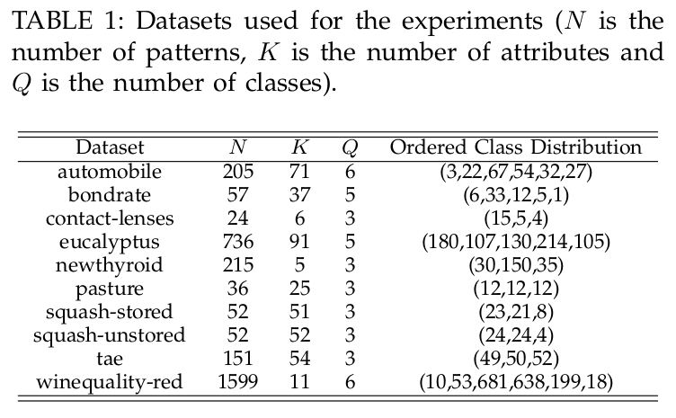

===================================================================
Exploitation of Pairwise Class Distances for Ordinal Classification
===================================================================

\J. Sánchez-Monedero (jsanchezm@uco.es) [1]_, Pedro A. Gutiérrez , Peter Tiño [2]_, C. Hervás-Martínez. 

.. [1] \J. Sánchez-Monedero, Pedro A. Gutiérrez and C. Hervás-Martínez are with the Department of Computer Science and Numerical Analysis, University of Córdoba, Campus de Rabanales, C2 building, 14074 - Córdoba, Spain. E-mail: jsanchezm@uco.es, pagutierrez@uco.es, chervas@uco.es.
.. [2] Peter Tiño is with the School of Computer Science, The University of Birmingham, Birmingham B15 2TT, United Kingdom. E-mail: P.Tino@cs.bham.ac.uk.

.. contents:: \

.. sectnum:: 
   :suffix: .

Introduction
============

This web page provides supplementary material for the paper entitled *Exploitation of Pairwise Class Distances for Ordinal Classification* submitted to `Neural Computation (NECO) <http://www.mitpressjournals.org/loi/neco/>`__

Source code
===========

This section provides source code for calculating the Pairwise Class Distance (PCD) projection presented in the paper, and it also presents the Pairwise Class Distance Ordinal Classifier (PCDOC) algorithm. All the source code can be downloaded in a single compressed file together with libSVM 3.0 for Matlab, and with the .mat files for the synthetic datasets: `pcdoc-code.zip <pcdoc-code.zip>`__ (this file contains the whole files set needed for executing the algorithm and helper functions). Please, note the source code is not optimized in order to improve the readability. 

Pairwise Class Distance projection and classifier
-------------------------------------------------

- Pairwise Class Distance projection: `pcdprojection.m <code/pcdprojection.m>`__
- PCD Ordinal Classifier: `PCDOC_classify.m <code/PCDOC_classify.m>`__
- Example of training with epsilon-SVR: `PCDOC_train.m <code/PCDOC_train.m>`__
- Example of predicting class labels with epsilon-SVR: `PCDOC_predict.m <code/PCDOC_predict.m>`__

Synthetic datasets projection analysis
--------------------------------------

- Synthetic datasets: `SyntheticLinearOrder.mat <code/SyntheticLinearOrder.mat>`__, `SyntheticNonLinearOrder.mat <code/SyntheticNonLinearOrder.mat>`__
- Projection analysis: `pcdprojection_syntheticlinear.m <code/pcdprojection_syntheticlinear.m>`__, `pcdprojection_syntheticnonlinear.m <code/pcdprojection_syntheticnonlinear.m>`__

Auxiliary functions
-------------------

- `PCDOC_preprocess.m <code/tools/PCDOC_preprocess.m>`__: Load, standarize train+test dataset and extract dataset information
- `PCDOC_performanceMetrics.m <code/tools/PCDOC_performanceMetrics.m>`__: This function calculates some ordinal classification performance metrics.

Code execution example
----------------------

.. include:: code/PCDOC_example.m
   :literal:
   
.. code:: matlab
   
   % Execution example of the PCDOC algorithm by using e-SVR as regressor tool
   clearvars;
   
   % Add libSVM matlab version. It is compiled for 64bits machines running
   % GNU/Linux. 
   addpath libsvm-mat-3.0-1/
   addpath tools/
   
   datasetTrainFile = '../ordinal-classification-datasets/contact-lenses/gpor/train_contact-lenses.0';
   datasetTestFile = '../ordinal-classification-datasets/contact-lenses/gpor/test_contact-lenses.0';
   
   % SVR hyperparameters example (must be crossvalided):
   hyperparam.k = 0.001;
   hyperparam.c = 1000;
   hyperparam.e = 0.1000;
   
   % Load and preprocess (standarize) data
   dataset = ...
       PCDOC_preprocess(datasetTrainFile,datasetTestFile);
   
   % Run PCDOC algorithm
   [pcdocModel, TrainPredictedY] = PCDOC_train(dataset.TrainP,dataset.TrainT,dataset.Q, hyperparam);
   TestPredictedY = PCDOC_predict(pcdocModel, dataset.TestP, dataset.Q);
   
   % Generate statistics
   pmTrain = PCDOC_performanceMetrics(dataset.TrainT, TrainPredictedY);
   pmTest = PCDOC_performanceMetrics(dataset.TestT, TestPredictedY);
   
   % Print statistics:
   fprintf('\nPerformance metrics:\n');
   fprintf('Acc: %f\n', pmTest.acc);
   fprintf('MAE: %f\n', pmTest.mae);
   fprintf('AMAE: %f\n', pmTest.amae);
   fprintf('Kendalls Taub: %f\n', pmTest.kendall);

Real ordinal classification data sets
=====================================

This section includes the datasets partitions used for the experiments. All the datasets described in the following above table can be downloaded:

- `Ordinal Classificacion datasets (ZIP compressed file) <ordinal-classification-datasets.zip>`__
- `Ordinal Classificacion datasets (TAR.GZ compressed file) <ordinal-classification-datasets.tar.gz>`__

Each file contains one folder for each dataset containing the 30-holdout train and generalization (test) partitions. Each partition is in four file formats: 

- ``gpor``: *GPOR* like file format, this is, each pattern is placed in a row with space separated attributes. The last column is the class label in a numeric format. *GPOR*, *SVOR-IN* and *SVOR-EX* algorithms use this format. The proposed method, SVR-PCDOC, uses this file format also. These algorithms assume the dataset files are ordered by class label in ascending order. KDLOR implementation by SVR-PCDOC uses  this format also.

- ``libsvm``: libSVM file format.

- ``weka``: Weka file format.

- ``nnep``: JCLEC-NNEP file format (`file format description available at Partitions and Source Code section of AYRNA's website <http://www.uco.es/ayrna/index.php?option=com_content&view=article&id=64&Itemid=78&lang=en>`__)

Source code license 
===================

.. code:: matlab

	%%%%%%%%%%%%%%%%%%%%%%%%%%%%%%%%%%%%%%%%%%%%%%%%%%%%%%%%%%%%%%%%%%%%%%%%%%%%%%%%%%
	% Copyright (C) Javier Sánchez Monedero (jsanchezm at uco dot es)
	% 
	% This code implements the Pairwise Class Distances (PCD) projection and the
	% associated PCD Ordinal Classifier (PCDOC).
	% 
	% The code has been tested with Ubuntu 11.04 x86_64 and Matlab R2009a
	% 
	% If you use this code, please cite the associated paper
	% Code updates and citing information:
	% http://www.uco.es/grupos/ayrna/neco-pairwisedistances
	% 
	% AYRNA Research group's website:
	% http://www.uco.es/ayrna 
	%
	% This program is free software; you can redistribute it and/or
	% modify it under the terms of the GNU General Public License
	% as published by the Free Software Foundation; either version 3
	% of the License, or (at your option) any later version.
	%
	% This program is distributed in the hope that it will be useful,
	% but WITHOUT ANY WARRANTY; without even the implied warranty of
	% MERCHANTABILITY or FITNESS FOR A PARTICULAR PURPOSE.  See the
	% GNU General Public License for more details.
	%
	% You should have received a copy of the GNU General Public License
	% along with this program; if not, write to the Free Software
	% Foundation, Inc., 51 Franklin Street, Fifth Floor, Boston, MA 02110-1301, USA. 
	% Licence available at: http://www.gnu.org/licenses/gpl-3.0.html
	%%%%%%%%%%%%%%%%%%%%%%%%%%%%%%%%%%%%%%%%%%%%%%%%%%%%%%%%%%%%%%%%%%%%%%%%%%%%%%%%%%

`Learning and Artificial Neural Networks research group <http://www.uco.es/ayrna/index.php?&lang=en>`__ website

*Javier Sánchez-Monedero et. al 2012* 

.. raw:: html

 

